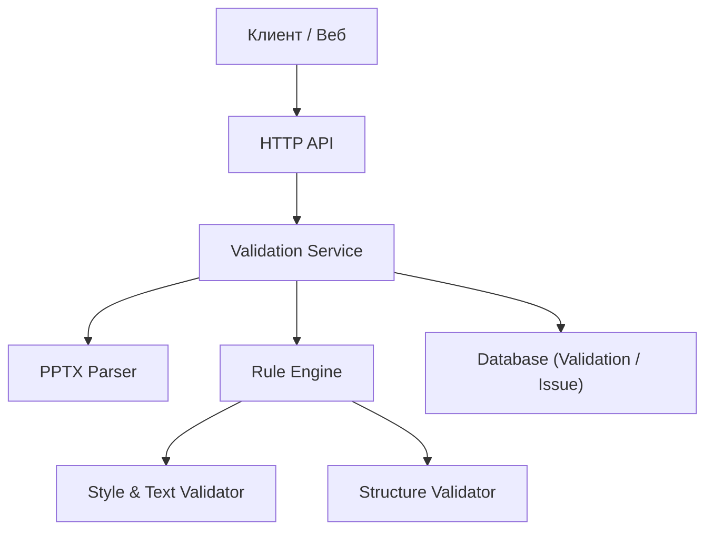
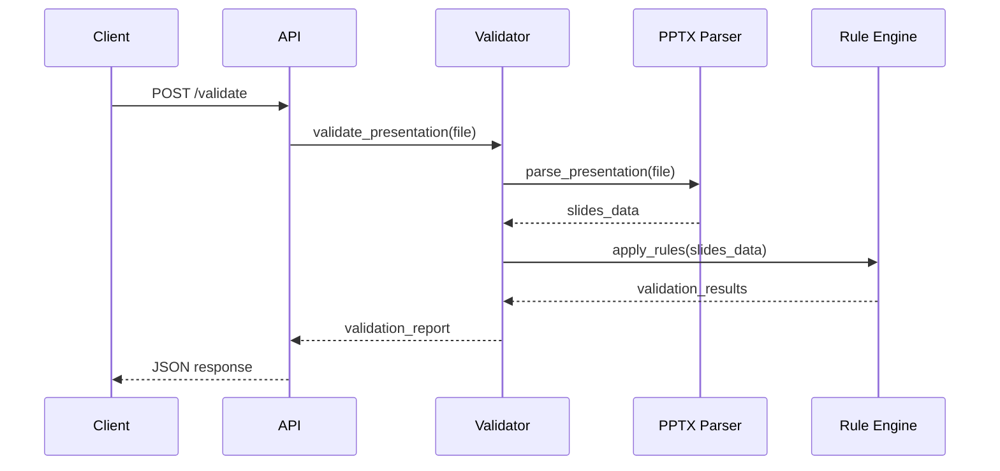
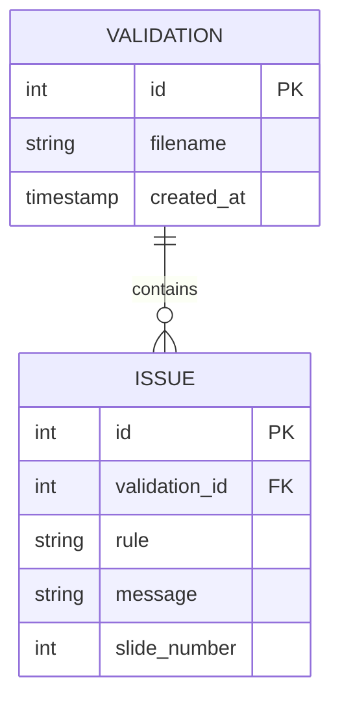

# **Presentation Validator - Документация проекта**

## Описание проекта

HTTP API на Python для валидации структуры и формата PowerPoint презентаций.
Система обнаруживает типичные ошибки: списки из одного пункта, разнобой в шрифтах, слишком много текста на слайде.
В будущем планируется расширение на ML-проверки для более сложных ошибок.

**Команда**: 2 человека
**Технологии**: Python, FastAPI, SQLAlchemy (async), Docker, pytest, python-pptx

---

### Что будет видеть пользователь

* Web-страница с формой загрузки `.pptx` файла

* Кнопка «Проверить презентацию»

* JSON-ответ с детализированным отчетом об ошибках

* Список найденных ошибок на странице

* Таблица с историей предыдущих проверок

* REST API endpoints:

  * **POST /validate** — загрузка презентации и запуск проверки
  * **GET /validations** — список всех проверок
  * **GET /validations/{id}** — детали конкретной проверки

---

### Распределение задач

#### Участник 1

* FastAPI приложение и endpoints
* Docker контейнеризация
* Database модели и миграции
* Интеграционное тестирование

#### Участник 2

* Парсинг PPTX файлов
* Реализация правил валидации
* ML компоненты для сложных проверок (будет позже)
* Модульное тестирование валидаторов

---

### План разработки

#### Неделя 1: Базовая инфраструктура

* Настройка проекта и окружения
* Базовый парсер PPTX (`parse_presentation`)
* Схема БД и дизайн API

#### Неделя 2: Ядро валидации

* Реализация основных правил проверки (single bullet, font inconsistency, text overflow)
* FastAPI endpoints и веб-страница

#### Неделя 3: ML компонент и тестирование

* ML модели для сложных проверок (планируется)
* Тестирование и bug fixing
* Документация и деплой

---

## Архитектура системы

### Компоненты системы

---

### Диаграмма последовательности

---

### Схема базы данных

---

### Принципы архитектуры

* **SOLID**: разделение ответственности между сервисами (API, валидаторы, парсер, БД)
* **DRY**: переиспользование кода через базовые классы и функции
* **Strategy Pattern**: разные правила валидации подключаются динамически
* **Repository Pattern**: работа с базой через SQLAlchemy async
* **Минимум глобального состояния**, все сервисы асинхронные

