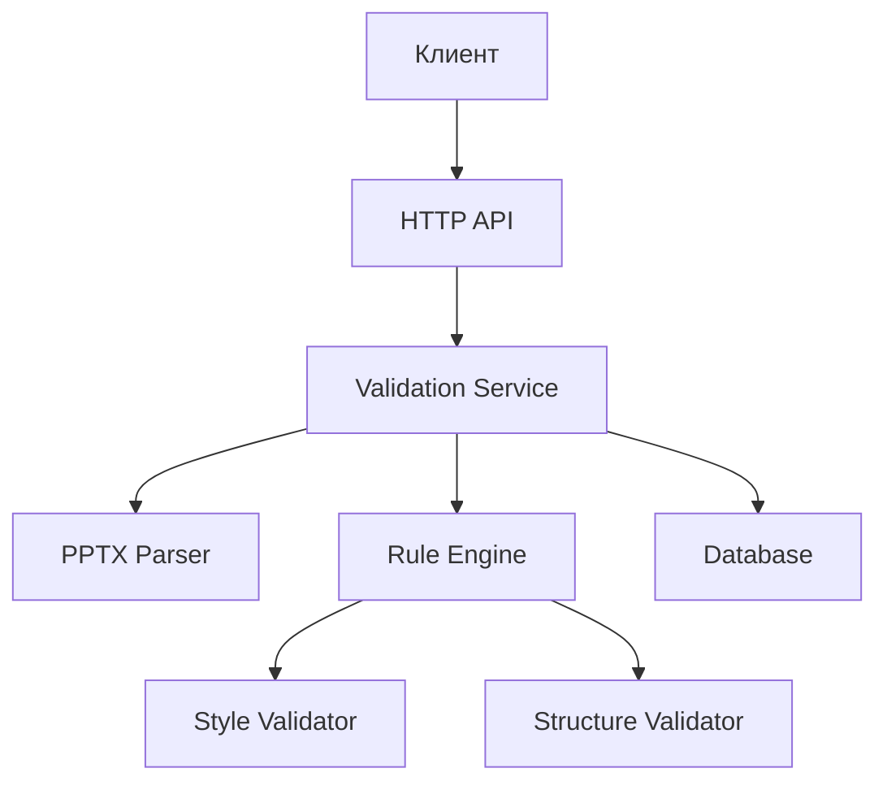
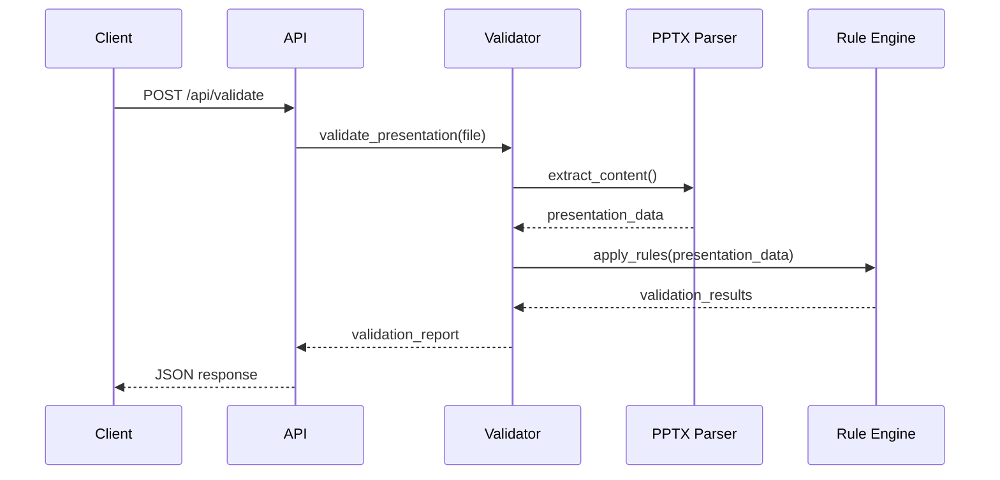
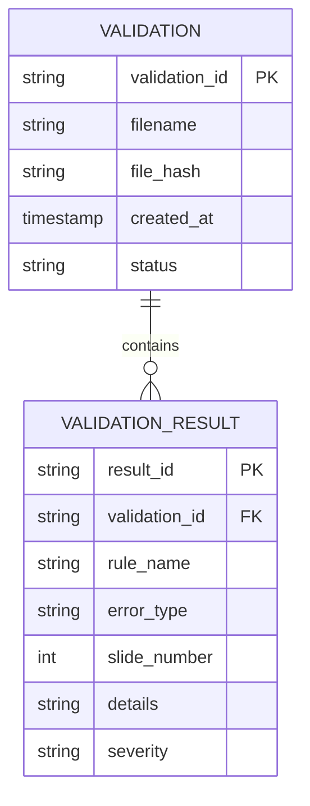

# Presentation Validator - Документация проекта

## Описание проекта
HTTP API на Python для валидации структуры и формата PowerPoint презентаций. 
Система обнаруживает типичные ошибки: списки из одного пункта, разнобой в шрифтах, забытую нумерацию слайдов.

**Команда**: 2 человека  
**Технологии**: Python, FastAPI, SQLAlchemy, Docker, pytest, python-pptx, scikit-learn

### Что будет видеть пользователь
- REST API endpoint для загрузки презентаций
- JSON ответ с детализированным отчетом об ошибках
- Возможность получить историю проверок

### Распределение задач
#### Участник 1

- FastAPI приложение и endpoints
- Docker контейнеризация
- Database модели и миграции
- Интеграционное тестирование

#### Участник 2

- Парсинг PPTX файлов
- Реализация правил валидации
- ML модели для сложных проверок
- Модульное тестирование валидаторов

### План разработки

#### Неделя 1: Базовая инфраструктура

- Настройка проекта и окружения
- Базовый парсер PPTX
- Схема БД и API design

#### Неделя 2: Ядро валидации

- Реализация основных правил проверки 
- FastAPI endpoints

#### Неделя 3: ML компонент и тестирование

- ML модели для сложных проверок 
- Тестирование и bug fixing
- Документация и деплой

## Архитектура системы

### Компоненты системы

```mermaid
graph TB

    A[Клиент] --> B[HTTP API]
    B --> C[Validation Service]
    C --> D[PPTX Parser]
    C --> E[Rule Engine]
    E --> F[Style Validator]
    E --> G[Structure Validator]
    C --> H[Database]
```

### Диаграмма последовательности

```mermaid
sequenceDiagram
    participant C as Client
    participant A as API
    participant V as Validator
    participant P as PPTX Parser
    participant R as Rule Engine
    
    C->>A: POST /api/validate
    A->>V: validate_presentation(file)
    V->>P: extract_content()
    P-->>V: presentation_data
    V->>R: apply_rules(presentation_data)
    R-->>V: validation_results
    V-->>A: validation_report
    A-->>C: JSON response
```

### Схема базы данных

```mermaid
erDiagram
    VALIDATION ||--o{ VALIDATION_RESULT : contains
    VALIDATION {
        string validation_id PK
        string filename
        string file_hash
        timestamp created_at
        string status
    }
    VALIDATION_RESULT {
        string result_id PK
        string validation_id FK
        string rule_name
        string error_type
        int slide_number
        string details
        string severity
    }
```

### Принципы архитектуры
- **SOLID**: Разделение ответственности между сервисами
- **DRY**: Переиспользование кода через базовые классы
- **Factory Pattern**: Создание валидаторов
- **Strategy Pattern**: Различные правила валидации
- **Repository Pattern**: Работа с базой данных
